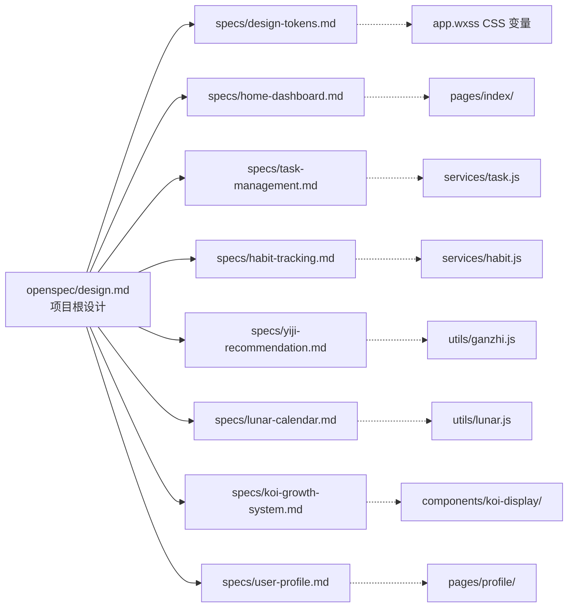

# 素简 · 项目根设计文档

> **文件:** `openspec/design.md`  
> **作用:** 项目级技术规范，被所有 capability spec 引用  
> **适用:** 所有 Phase 的开发工作  
> **状态:** 草稿

---

## 1. 项目概览

### 1.1 产品定位

一款融合中国传统文化的个人计划管理与微习惯养成微信小程序。以「素简」为核心理念，将计划管理、微习惯打卡、八卦五行宜忌推荐、锦鲤成长系统四位一体。

### 1.2 技术栈

| 层 | 技术 | 版本/说明 |
|----|------|-----------|
| 框架 | 微信小程序原生框架 | WXML + WXSS + JavaScript |
| 语言 | JavaScript (ES6+) | 小程序原生支持 |
| 字体 | Noto Sans SC / PingFang SC | 系统字体或内嵌字体 |
| 动画 | CSS @keyframes + 小程序动画 API | — |
| 图标 | 内联 SVG | 极简几何描边风格 |
| 数据存储 | 微信云开发数据库 | 云数据库 + 本地缓存 |
| 天干地支算法 | 本地查表 | 预置 JSON 数据，离线可用 |

### 1.3 成功标准

| 维度 | 目标 |
|------|------|
| 功能完整性 | 通过所有 10 项功能验收（见需求文档 §10） |
| 视觉一致性 | 通过所有 6 项视觉验收（见需求文档 §10） |
| 离线可用性 | 农历和宜忌在无网络时正常显示 |
| 动画流畅度 | 60fps，无卡顿闪烁 |

---

## 2. Commands（开发命令）

### 2.1 微信开发者工具

```bash
# 打开项目
wechat-devtools /path/to/project

# 构建 npm
npm install
# 微信小程序 → 工具 → 构建 npm

# 预览（生成二维码）
# 微信开发者工具 → 预览

# 上传代码
# 微信开发者工具 → 上传

# 云开发部署
# 微信开发者工具 → 云开发 → 上传云函数
```

> 微信小程序依赖开发者工具的图形界面，没有完整的 CLI 构建链。用 `miniprogram-ci` 可以实现 CI 集成：
> ```bash
# 安装 miniprogram-ci
npm install miniprogram-ci --save-dev

# CI 预览（需 appid 和私钥）
npx miniprogram-ci preview --appid <appid> --ppp <private-key-path> --project-path .

# CI 上传
npx miniprogram-ci upload --appid <appid> --ppp <private-key-path> --project-path . --robot 1
```

### 2.2 云开发

```bash
# 云函数开发（需安装 @cloudbase/cli）
npm install -g @cloudbase/cli

# 部署云函数
tcb functions deploy <function-name>

# 本地调试云函数
tcb functions run <function-name> --local
```

---

## 3. 项目目录结构

```
su-jian/
├── project.config.json        # 小程序项目配置
├── app.js                     # 应用入口
├── app.json                   # 全局配置（页面路由、TabBar）
├── app.wxss                   # 全局样式（CSS 变量声明）
├── sitemap.json               # 搜索配置
│
├── pages/
│   ├── index/                 # 首页（Tab 1）
│   │   ├── index.wxml
│   │   ├── index.wxss
│   │   ├── index.js
│   │   └── index.json
│   ├── list/                  # 清单·打卡页（Tab 2）
│   │   ├── list.wxml
│   │   ├── list.wxss
│   │   ├── list.js
│   │   └── list.json
│   └── profile/               # 我的页面（Tab 3）
│       ├── profile.wxml
│       ├── profile.wxss
│       ├── profile.js
│       └── profile.json
│
├── components/                # 公共组件
│   ├── task-card/             # 任务卡片
│   ├── habit-card/            # 习惯卡片
│   ├── yiji-card/             # 宜忌卡片
│   ├── koi-display/           # 锦鲤展示
│   ├── calendar/              # 打卡月历
│   ├── add-plan-drawer/       # 添加计划抽屉
│   ├── toast/                 # Toast 提示
│   └── stats-card/            # 概览统计卡片
│
├── utils/                     # 工具函数
│   ├── ganzhi.js              # 天干地支计算
│   ├── lunar.js               # 农历转换
│   ├── streak.js              # 连续天数计算
│   ├── date.js                # 日期格式化
│   └── constants.js           # 常量（宜忌表、等级表等）
│
├── services/                  # 数据服务层
│   ├── user.js                # 用户数据 API
│   ├── task.js                # 任务数据 API
│   ├── habit.js               # 习惯数据 API
│   ├── record.js              # 打卡记录 API
│   └── sync.js                # 数据同步
│
├── cloud/                     # 云开发
│   ├── functions/
│   │   ├── login/             # 登录云函数
│   │   ├── sync-data/         # 数据同步云函数
│   │   └── export-data/       # 数据导出云函数
│   └── database/
│       └── schema/            # 数据库集合结构
│
├── assets/                    # 静态资源
│   ├── icons/                 # SVG 图标
│   ├── data/                  # 预置数据（干支表、农历表等）
│   └── fonts/                 # 字体文件（可选）
│
└── tests/                     # 测试
    ├── unit/                  # 单元测试
    │   ├── ganzhi.test.js
    │   ├── lunar.test.js
    │   └── streak.test.js
    └── mocks/                 # 测试 mock 数据
        ├── tasks.json
        └── habits.json
```

### 3.1 文件命名约定

| 文件类型 | 命名规则 | 示例 |
|----------|----------|------|
| 页面文件 | kebab-case | `task-card/`、`add-plan-drawer/` |
| JS 文件 | kebab-case | `ganzhi.js`、`streak.js` |
| JSON 数据 | kebab-case | `lunar-data.json` |
| SVG 图标 | kebab-case | `icon-home.svg` |
| 测试文件 | 对应源文件 + `.test` | `ganzhi.test.js` |

---

## 4. 代码风格

### 4.1 JavaScript 规范

| 规则 | 约定 |
|------|------|
| 变量命名 | camelCase（`let completedCount`） |
| 常量命名 | UPPER_SNAKE_CASE（`const MAX_STREAK_DAYS = 365`） |
| 函数命名 | camelCase 动词开头（`getLunarDate()`） |
| 类/构造函数 | PascalCase（`class KoiSystem`） |
| 缩进 | 2 空格 |
| 分号 | 使用（行尾加分号） |
| 引号 | 单引号优先 |
| 尾逗号 | 多行时加尾逗号 |

### 4.2 代码示例

```javascript
// ========================================
// utils/streak.js — 连续天数计算
// ========================================

const STREAK_TITLES = {
  7: '一周有成',
  21: '三周之功',
  30: '一月之期',
  100: '百日筑基',
  365: '周而复始',
};

/**
 * 计算单个习惯的连续打卡天数
 * @param {Array<{date: string, count: number}>} records - 打卡记录
 * @param {string} today - 今日日期 'YYYY-MM-DD'
 * @param {Object} frequency - 频率配置
 * @returns {number} 连续天数
 */
function calcStreak(records, today, frequency) {
  if (!records || records.length === 0) return 0;

  const recordMap = new Map();
  records.forEach(r => recordMap.set(r.date, r.count));

  let streak = 0;
  let current = new Date(today);

  while (true) {
    const dateStr = formatDate(current);
    const count = recordMap.get(dateStr) || 0;
    const isActiveDay = isActiveFrequency(current, frequency);

    if (isActiveDay && count <= 0) break;

    if (isActiveDay && count > 0) streak++;

    current.setDate(current.getDate() - 1);
  }

  return streak;
}

module.exports = {
  calcStreak,
  STREAK_TITLES,
};
```

### 4.3 WXML 模板规范

| 规则 | 约定 |
|------|------|
| 属性顺序 | `class` → `id` → `data-*` → `bind*` → 其他属性 |
| 条件渲染 | 优先用 `wx:if`，少用 `hidden` |
| 列表渲染 | 始终带 `wx:key` |
| 事件命名 | `bind:tap`（冒号语法），处理函数名 `onTapXxx` |

```html
<!-- components/task-card/task-card.wxml -->
<view
  class="task-card {{completed ? 'task-card--done' : ''}}"
  data-id="{{task.id}}"
  bind:tap="onToggleComplete"
  bind:longpress="onShowActions"
>
  <view class="task-card__check {{completed ? 'task-card__check--checked' : ''}}">
    <icon type="{{completed ? 'success' : 'circle'}}" />
  </view>
  <view class="task-card__body">
    <text class="task-card__title {{completed ? 'task-card__title--done' : ''}}">
      {{task.title}}
    </text>
    <view class="task-card__meta">
      <text class="priority-tag priority-tag--{{task.priority}}">
        {{priorityLabel[task.priority]}}
      </text>
      <text class="category-tag">{{task.category}}</text>
    </view>
  </view>
  <view class="task-card__stamp" wx:if="{{completed}}">完</view>
</view>
```

### 4.4 WXSS 规范

- 使用 CSS 变量（定义于 `app.wxss`），见 [design-tokens spec](./specs/design-tokens.md)
- class 命名：BEM 风格（`block__element--modifier`）
- 不使用 `id` 选择器
- 不使用 `!important`（除非覆盖第三方组件）

---

## 5. 测试策略

### 5.1 框架选择

| 测试类型 | 框架 | 说明 |
|----------|------|------|
| 单元测试 | Jest (`jest`) | 纯函数测试（工具函数、数据计算） |
| 组件测试 | 无（微信小程序生态限制） | 手动测试为主 |
| E2E 测试 | 微信开发者工具 | 真机预览 + 手动验收 |

### 5.2 测试范围

```
测试金字塔（微信小程序）
        ╱╲
       ╱  ╲         手动 E2E（真机验收）
      ╱    ╲
     ╱──────╲
    ╱  unit  ╲        Jest 单元测试（工具函数、算法）
   ╱──────────╲
```

| 层 | 范围 | 覆盖目标 |
|----|------|----------|
| 单元测试 | `utils/` 下的纯函数 | 80%+ 分支覆盖率 |
| 手动测试 | 所有页面交互 | 通过全部验收标准 |
| 真机预览 | 提交前 | 无崩溃、无样式错乱 |

### 5.3 单元测试规范

```javascript
// tests/unit/streak.test.js
const { calcStreak, STREAK_TITLES } = require('../../utils/streak');

describe('calcStreak', () => {
  it('无记录时返回 0', () => {
    expect(calcStreak([], '2025-10-15', { type: 'daily' })).toBe(0);
  });

  it('连续 7 天打卡返回 7', () => {
    const records = [
      { date: '2025-10-09', count: 1 },
      { date: '2025-10-10', count: 1 },
      { date: '2025-10-11', count: 1 },
      { date: '2025-10-12', count: 1 },
      { date: '2025-10-13', count: 1 },
      { date: '2025-10-14', count: 1 },
      { date: '2025-10-15', count: 1 },
    ];
    expect(calcStreak(records, '2025-10-15', { type: 'daily' })).toBe(7);
  });

  it('断点后重置', () => {
    const records = [
      { date: '2025-10-13', count: 1 },
      // 10/14 未打卡 — 断点
      { date: '2025-10-15', count: 1 },
    ];
    expect(calcStreak(records, '2025-10-15', { type: 'daily' })).toBe(1);
  });
});

describe('STREAK_TITLES', () => {
  it('7 天称号为"一周有成"', () => {
    expect(STREAK_TITLES[7]).toBe('一周有成');
  });
});
```

### 5.4 测试运行

```bash
# 运行所有单元测试
npx jest

# 运行单个测试文件
npx jest tests/unit/streak.test.js

# 带覆盖率报告
npx jest --coverage

# watch 模式
npx jest --watch
```

---

## 6. 边界规则

### 6.1 Always do（始终要做）

| 规则 | 说明 |
|------|------|
| 更新 spec 再改代码 | 任何行为变更先更新对应的 `.md` 再写代码 |
| 保持离线可用 | 天干地支、农历等核心数据不得依赖网络 |
| 使用 CSS 变量 | 颜色、间距、圆角必须引用 `app.wxss` 中的变量 |
| 跑单元测试 | `utils/` 的纯函数必须有 Jest 测试并通过 |
| 遵循命名规范 | 目录、文件、变量、函数按 §4 的约定 |
| 真机预览 | 提交前在微信开发者工具真机调试 |
| 内联 SVG | 图标使用内联 SVG，不用位图图片 |

### 6.2 Ask first（先问再动）

| 场景 | 原因 |
|------|------|
| 改数据库集合结构 | 影响云函数和数据迁移 |
| 加第三方依赖/npm 包 | 增加包体积，需要评估替代方案 |
| 改页面路由结构 | 影响 app.json 配置和 Tab 导航 |
| 改 CSS 变量定义 | 影响全局视觉统一性 |
| 改查表数据格式 | 干支/农历数据变更需要重新生成 |
| 加新页面 | 需要确认是否在 MVP 范围内 |
| 换字体 | 包体积和加载性能评估 |

### 6.3 Never do（绝不做）

| 规则 | 说明 |
|------|------|
| 提交敏感信息 | openid、appsecret、私钥等不进版本控制 |
| 用 border 代替内阴影 | 违背视觉规范 "无线框分割" 原则 |
| 修改 data/ 下预置 JSON 的格式 | 影响查表算法的一致性 |
| 在 utils/ 中使用 wx API | 工具函数必须是纯函数 |
| 跳过验收标准 | 每个 Phase 的验收项必须逐条通过 |
| 位图替代 SVG | 图标必须是矢量，不引入 PNG/JPG |
| 依赖网络的玄学计算 | 宜忌算法必须本地完成 |

---

## 7. 与 Capability Spec 的关系



- `design.md` 定义**怎么做**（技术规范）
- `specs/*.md` 定义**做什么**（行为规范）
- 实现时两者同时参考
